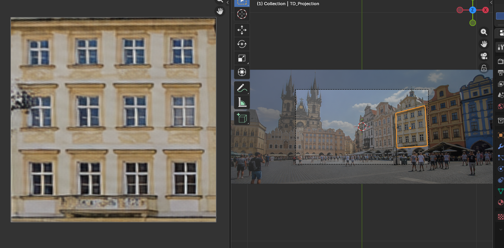

# Textur Decomposer (Blender addon)

HAND Tool for recovering **rectified (square) textures** from tilted surfaces in a static
photo — walls, floors, tables, etc. This is the Blender re-implementation of
the original [TexturDecomposer C#](https://https://github.com/ritsudo/TexturDecomposer) tool.
(some parts are similar to the fSpy functionality, but with modern Blender)

Blender target: **4.2+ / 5.0+** (extension format, `blender_manifest.toml`).

## What it does

1. **Import a photo** (`png`, `jpg`, …) into the scene as a textured source
   plane, framed by a camera.
2. **Create projection planes** (as many as you like) and translate / rotate /
   scale them. Each projection plane reads the pixels of the photo that sit
   "behind" its four corners.
3. The plane's material and its `<plane>_texture` datablock update live while
   you move. Preview the result in the **Texture Paint** editor (or the Image
   Editor) — no separate preview window is needed.
4. **Save Texture** extracts the result at full resolution and stores it as a
   Blender image datablock in the scene **image pool** (`<plane>_texture`).
   Switch to the *Image Editor*, or reuse/export it anywhere in the scene. If
   the plane is moved again, the image is re-saved.

Each projection can output either a **square** texture or preserve the
projection plane's **original ratio** (rectangle). In the latter case the
rectangle is fitted into the square by its longest side and the remaining area
is filled with transparent pixels, white or black — handy for later editing in
an external image editor.

## Known bugs v 0.2.1
- Texture update may be stopped in the new project
Solution: reload Blender, create new project, then import

- Still some troubles with rectangle texture assignment for plane (not critical)

### Performance

Moving a plane stays responsive because interactive updates use a fast
nearest-neighbour pass, throttled to ~20 updates/second. Once the plane stops
moving (or the modal operator is confirmed) a debounced timer runs the final
full-quality bilinear extraction. Toggle **Auto Finalize** off if you prefer to
run the final pass manually with *Update Texture* / *Save Texture*.

## Installation

### As a Blender extension (4.2+ / 5.0+)
1. Download the release from the "Releases" section
2. `Edit ▸ Preferences ▸ Add-ons ▸ Install from Disk…` and pick the zip.

### As a legacy addon
Copy the `texturdecomposer/` folder into your
`…/scripts/addons/` directory and enable **Textur Decomposer**.

## Usage

1. Open the 3D viewport sidebar (`N`) → **Textur Decomposer** tab.
2. **Import Source Image** — pick a photo. A plane and a fitted camera are
   created. Press `Numpad 0` to look through the camera if you wish.
3. **Add Projection Plane** — a quad appears over the photo. Align its corners
   with the tilted surface in the photo:
   * `Move / Rotate / Scale Projection Plane` (mouse):
     * drag = move, `T` translate, `R` rotate, `S` scale,
     * `LMB` / `Enter` = apply and save, `Esc` = cancel.
   * or use Blender's native `G` / `R` / `S` — the texture updates live.
4. Open the **Texture Paint** tab (or Image Editor) next to the 3D viewport and
   select `<plane>_texture` to watch the result while you align the plane, until
   the pattern lines up in straight horizontal/vertical rows.
5. **Save Texture** to (re)write `<plane>_texture` into the image pool.
6. Repeat **Add Projection Plane** for other surfaces.

### Output shape
* **Square** — the sampled region fills the whole texture (default).
* **Original Ratio** — keeps the projection plane's width/height ratio, fits it
  into the square by the longest side and pads the rest with the chosen
  **Padding** colour (transparent / white / black). **Placement** puts the
  rectangle on the **Left**, **Center** or **Right** of the padded axis.

The stored `<plane>_texture` is always the padded square (ready for export),
but the projection plane itself only shows the content, stretched back to fill
the plane, so no margins appear in the viewport.

### Projection origin modes
* **Scene Camera** *(default)* — rays are cast from the camera through the
  quad corners onto the photo. This reproduces the true perspective of the
  original tool (tilting the quad converges the sampled trapezoid).
* **Object** — same, but from a chosen empty/object (a custom viewpoint).
* **Parallel** — corners are dropped straight along the photo's normal
  (affine projection; no perspective convergence).

## Notes / implementation

* Core math lives in `tdmath.py` (pure NumPy, no Blender dependency):
  a 4-point **homography** (DLT) maps the unit square to the projected
  quadrilateral, and the photo is resampled with bilinear filtering.
  Run the numeric self-test with `python dev/selftest.py`.
* `extraction.py` bridges Blender datablocks and the math; source pixels are
  cached as a NumPy array and the output is written into
  `bpy.data.images`.
* `live.py` refreshes the output texture while a plane moves
  (`depsgraph_update_post` handler) using the fast nearest-neighbour pass, and
  schedules the final bilinear pass with a debounced `bpy.app.timers` timer.
* A generated image is only persisted inside a `.blend` once **packed**;
  *Save Texture* packs the output image.

## Changelog

### 0.2.1
* Fixed *Original Ratio* mode: the padded square texture is no longer shown on
  the projection plane (which distorted/obscured the view). The plane now maps
  only the content sub-region, stretched back to fill it, via a material
  Mapping node.
* Added the **Placement** selector (Left / Center / Right) for where the
  rectangle sits inside the stored square.

### 0.2.0
* Removed the separate corner preview window and the extra preview image
  datablock; the projection plane material and `<plane>_texture` are the
  preview (view it in the Texture Paint / Image editor).
* Added the **Output Shape** flag: *Square* or *Original Ratio*, with
  transparent / white / black **Padding** for the unused square area.
* Interactive performance: nearest-neighbour fast pass while moving plus a
  debounced full-quality finalize when the plane stops.

### 0.1.0
* Initial Blender port: import source image, projection planes, modal
  move/rotate/scale, homography rectification, save to the image pool.

### Third-party code / references

No third-party source code was copied into this addon. The algorithms are
standard, public techniques; the following were consulted as references and
are credited here as required:

* **Original tool** — `TexturDecomposer-c#` in this repository (the behaviour
  being ported).
* **Homography / DLT** — Hartley & Zisserman, *Multiple View Geometry in
  Computer Vision*, 2nd ed., Cambridge University Press, 2004, §4.1
  (the direct linear transform used by `find_homography`).
* **NumPy** — https://numpy.org (BSD-3-Clause).
* **Blender Python API** — image `pixels` (`foreach_get`/`foreach_set`),
  `bpy.app.handlers.depsgraph_update_post`, `bpy.app.timers`
  (https://docs.blender.org/api/current/).
* Concept references (reviewed, **not** reused as code):
  * Blender built-in *Images as Planes* addon
    (https://docs.blender.org/manual/en/latest/modeling/meshes/import_images_as_planes.html).
  * `Pullusb/reference_to_image_plane` (MIT) and
    `Pullusb/Tesselate_texture_plane`.
  * *Perspective Plotter* and *Eyek* — checked for overlap; neither provides
    interactive quad → rectified-texture extraction, so a new addon was
    written.

## License

GPL-3.0-or-later (matches Blender's addon convention).